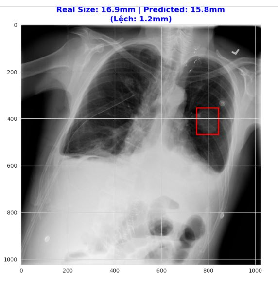

# Topic_1-Medical-Image-Regression - Tumor Size Prediction using Deep Learning
> Dự đoán kích thước khối u phổi trên ảnh X-quang sử dụng mạng nơ-ron tích chập (CNN).


## 📖 Giới thiệu (Overview)
Dự án này tập trung giải quyết bài toán **Hồi quy (Regression)** trong y tế: Dự đoán chính xác đường kính khối u (đơn vị mm) từ ảnh chụp X-quang lồng ngực. Thay vì chỉ phân loại (có bệnh/không bệnh), mô hình cung cấp thông tin định lượng để hỗ trợ bác sĩ chẩn đoán mức độ nghiêm trọng.

**Thách thức:**
- Dữ liệu hạn chế (Small Dataset ~164 ảnh).
- Sự mất cân bằng dữ liệu (Data Imbalance) giữa các kích thước u.
- Nhiễu ảnh y tế và sự đa dạng về vị trí/hình dạng khối u.

## 🛠️ Phương pháp & Kỹ thuật (Methodology)

### 1. Xử lý dữ liệu (Data Preprocessing)
- **Hợp nhất dữ liệu:** Kết hợp thông tin tọa độ Pixel và PixelSpacing để tính kích thước thực (mm).
- **Stratified Group Split:** Chia tập Train/Val/Test đảm bảo cân bằng phân phối kích thước u, tránh hiện tượng rò rỉ dữ liệu (Data Leakage) giữa các bệnh nhân.
- **Data Augmentation:** Áp dụng các kỹ thuật: Horizontal Flip, Rotation, Affine Translation, Gaussian Blur để tăng cường dữ liệu.

### 2. Kiến trúc Mô hình (Model Architecture)
Sử dụng **ResNet18** làm xương sống (Backbone) với chiến lược **Transfer Learning**:
- **Backbone:** ResNet18 (Pretrained on ImageNet).
- **Regression Head (Custom):**
  - Flatten -> Linear (512 -> 256) -> ReLU -> Dropout (0.5) -> Linear (1).
  - Output: 1 giá trị thực (Scalar) đại diện cho kích thước mm.
- **Loss Function:** L1 Loss (MAE) để tối ưu hóa sai số tuyệt đối.

### 3. Huấn luyện (Training Strategy)
- **Fine-tuning:** Unfreeze toàn bộ các lớp (Full Unfreeze) để mô hình học lại các đặc trưng y tế mức thấp.
- **Optimizer:** Adam với Learning Rate nhỏ ($1e-5$) và Weight Decay ($1e-4$) để chống Overfitting.
- **Scheduler:** ReduceLROnPlateau.

## 📊 Kết quả Thực nghiệm (Experimental Results)

Mô hình đạt được kết quả khả quan trên tập Test độc lập:

| Metric | Giá trị | Ý nghĩa |
| :--- | :--- | :--- |
| **MAE (Mean Absolute Error)** | **10 mm** | Sai số trung bình tuyệt đối |
| **MAPE (Mean % Error)** | **~44.03%** | Sai số phần trăm trung bình |
| **RMSE (Root Mean Sq. Error)** | 16.37 mm | Độ lệch chuẩn của sai số |

### Demo Dự đoán
*(Kết quả trực quan trên một ca bệnh cụ thể)*



> **Nhận xét:** Với khối u thực tế 16.9 mm, mô hình dự đoán 15.8 mm (Lệch 1.2mm). Đây là mức sai số chấp nhận được trong sàng lọc sơ bộ.

## 📁 Cấu trúc Thư mục (Project Structure)

```
Topic-1-Medical_Image_Regression/
│
├── data/                         # Thư mục chứa dữ liệu 
│   ├── raw/                      # Dữ liệu gốc (chưa xử lý)
│   │   ├── images/               # Ảnh X-ray / CT gốc ( 112020 ảnh nên hãy tự tải)
│   │   ├── BBox_List_2017.csv    # Thông tin bounding box khối u
│   │   └── Data_Entry_2017_v2020.csv  # Metadata (nhãn, thông tin ảnh)
│   │
│   └── processed/                # Dữ liệu sau tiền xử lý
│       ├── train.csv             # Tập huấn luyện
│       ├── val.csv               # Tập validation
│       └── test.csv              # Tập kiểm tra
│
├── history/                      # Lịch sử huấn luyện mô hình
│   ├── history_mae.pkl           # Loss MAE theo epoch
│   ├── history_mse.pkl           # Loss MSE theo epoch
│   └── history_no_aug.pkl        # History khi không dùng augmentation
│
├── saved_models/                 # Các mô hình đã train
│   ├── tumor_model.pth
│   ├── tumor_model_mae.pth       # Best Model (MAE)
│   ├── tumor_model_mse.pth
│   ├── tumor_model_noaug.pth
│   └── temp_best_ablation.pth
│
├── images/                       # Ảnh minh họa kết quả
│
├── medical-image-tumor-size-predict.ipynb
├── requirements.txt
├── README.md
└── .gitignore
```
